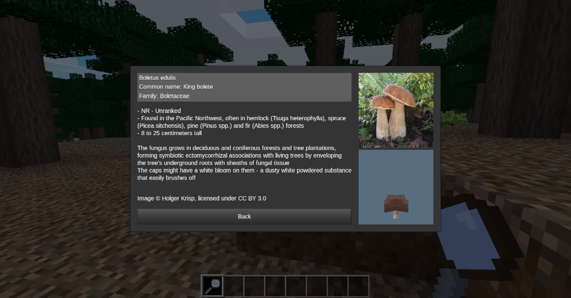
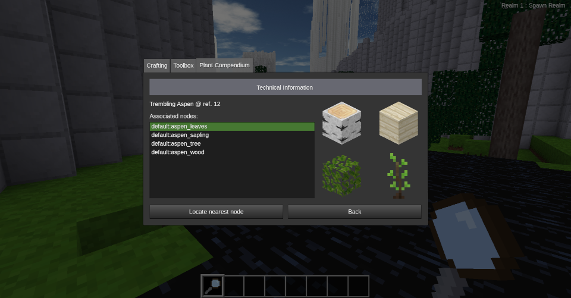
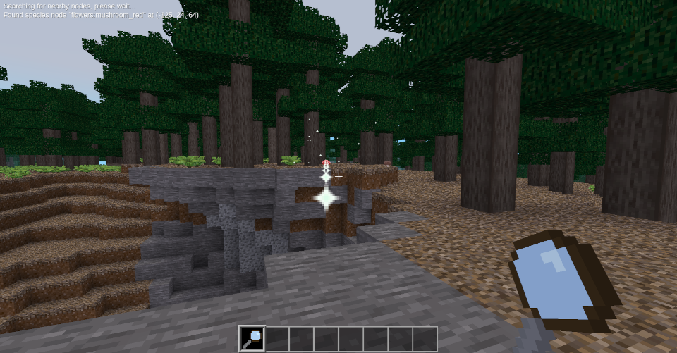

# `magnify` modpack

*Release version: n/a*  
*Dependencies: [`sfinv`](https://github.com/rubenwardy/sfinv)*

## About the modpack

The `magnify` modpack includes 3 mods: `magnify`, `magnify_default_nodes` and `magnify_flowers_nodes`.

The `magnify` mod adds a magnifying glass tool and plant compendium inventory tab to the game, allowing players to view information about real-life equivalents to the plant species present in Minetest. It also provides an API for registering and accessing information about these species.  
The `magnify_default_nodes` and `magnify_flowers_nodes` mods contain information about the real-life equivalents to the plant species present in the `default` and `flowers` mods, respectively. Information about these species is registered with the `magnify` API, allowing it to be displayed in-game.

### Screenshots

<!-- Using inline HTML for simpler image scaling -->
  

## Registering plant species using the `magnify` API

### Creating nodes

If the nodes for your species have already been created or are already part of a mod, you can skip this step and move to [creating a definition table](#creating-a-definition-table).  
If you are creating an entirely new species or are new to modding, you'll want to start by creating **nodes** for that species and adding them to a mod. See [the Minetest modding book][mod_book] and [the Minetest API documentation][api_docs] for more information on how to create a mod and how to create nodes.

Once you have your nodes created, take note of their technical names: you'll need them later. Then, you can begin registering your species with the `magnify` API!

### Configuring your mod

Before you can register plant species using the `magnify` mod, you'll need to add it as a dependency of your mod. To do that, add the following line to your mod's `mod.conf` file (if it isn't already there)

```lua
depends = magnify
```

If your mod already has dependencies, add `magnify` to the end of the list of your mod's dependencies, like so:

```lua
depends = wonderful_mod, another_cool_mod, magnify
```

Doing this ensures that your mod has access to all of the `magnify` mod's API functions when it runs. If you don't do this, your game could crash!

### Creating a definition table

Once your mod has been configured, you'll need to create a plant definition table for your species.

In the `init.lua` file (or another file) in your mod, create a table like this:

```lua
local def_table = {
    sci_name = "",          -- Scientific name of species
    com_name = "",          -- Common name of species
    fam_name = "",          -- Family name of species

    cons_status = {         -- Conservation statuses of species
        ns_global = "",         -- NatureServe global status
        ns_bc = "",             -- NatureServe BC status
        bc_list = ""            -- BC List (Red Blue List) status
    },
    tags = {""},            -- Tags representing various charactertistics of a species
    region = "",            -- Native region/range of species (displayed as "Found in [region]")
    height = "",            -- Species height
    bloom = "",             -- The way the species blooms
    more_info = "",         -- Extended description of species
    
    texture = {""},         -- Images of species (in `mod/textures`)
    model_obj = "",         -- Model file (in `mod/models`)
    model_rot_horiz = 0,    -- Initial horizontal rotation of model, about y-axis (in degrees; defaults to 180)
    model_rot_verti = 0,    -- Initial vertical rotation of model, about x-axis (in degrees; defaults to 0)
    model_rot_y = 0,        -- Alias for model_rot_horiz
    model_rot_x = 0,        -- Alias for model_rot_verti

    external_link = "",     -- Link to page with more species information
    img_copyright = "",     -- Copyright owner of species image (displayed as "Image (c) [img_copyright]")
    img_credit = "",        -- Author of species image (displayed as "Image courtesy of [img_credit]")
    info_source = "",       -- Source that species information was taken from
    last_updated = "",      -- Timestamp when species was last updated
}
```

This table contains all the properties that can be registered in a plant definition. All properties (except `sci_name`) are optional: if you don't want to use a property, you can remove it from the definition table and it won't show up.  
That being said, it is recommended to fill in at least these properties by adding text between the quotation marks `""` after each one:

- `sci_name` (**required**): The scientific name of your plant species, if it has one
- `com_name`: The common name of your plant species
- `more_info`: A description of your plant species - what it looks like, how it grows, or anything other notable things about it

Once that's done, you should have something like this (with all the properties you've filled in):

```lua
local my_species = {
    sci_name = "Populus tremuloides",
    com_name = "Trembling Aspen",
    fam_name = "Salicaceae",

    height = "Up to 25 meters tall",
    more_info = "Also known as the golden aspen, due to the golden colour its leaves turn in the fall.",
}
```

### Adding textures

To add textures for your species, you'll need to add them you your mod.

By convention, texture files go in the `textures` folder within your mod's folder. If your mod's folder does not already have a `textures` folder, create that folder in your mod's directory. Then, add all of your textures there.  
*For more information about how to structure a mod, see [the Minetest modding book][mod_book_structure] and [the Minetest API documentation][api_docs_structure].*

Minetest only supports textures in the following formats: PNG (`.png`), JPG/JPEG (`.jpg`), Bitmap (`.bmp`), and Targa (`.tga`). If your textures and not in any of these image formats, you'll need to convert them before you upload them in order for them to display properly in-game.  
*See [the Minetest API documentation][api_docs_textures] for more information about Minetest textures.*

Once your textures have been added to your mod's folder, you'll need to add their file names to the `texture` property of the plant species definition table you made before. Textures should be provided in a comma-separated list of texture names in quotations marks `""`, all within a table `{}`.

If you want to credit others for using their images, you can do that using either the `img_copyright` or `img_credit` property. The `img_copyright` property displays as "Image (c) `img_copyright`", while the `img_credit` property displays as "Image courtesy of `img_credit`". If both properties are present, the `img_copyright` property will take precedence.

Once your textures and/or image credits have been added, your definition table should look something like this:

```lua
local my_species = {
    sci_name = "Populus tremuloides",
    com_name = "Trembling Aspen",
    fam_name = "Salicaceae",

    height = "Up to 25 meters tall",
    more_info = "Also known as the golden aspen, due to the golden colour its leaves turn in the fall.",

    texture = {"trembling_aspen_1.png", "trembling_aspen_but_jpeg.jpg", "another_aspen_texture.bmp"},

    img_credit = "Paul Pickell, UBC Faculty of Forestry",
}
```

### Adding a model

Adding a model is a similar process as adding textures, except that models go into your mod folder's `models` folder instead.

Due to the way Minetest reads model files, if you are using a model in the `.obj` format, model texture names must be placed on `g` lines instead of `usemtl` lines. Models which do not follow this convention will still render in-game, but will not be able to use multiple textures.

Once your model has been added to the `models` folder, you'll need to add its file name to the `model_obj` property of the plant species definition table. The model name should be provided in quotation marks `""`.  
Additionally, you can specify an initial horizontal and vertical rotation for your model using the `model_rot_horiz` (or `model_rot_y`) and `model_rot_verti` (or `model_rot_x`) properties, respectively.

Once your model has been added, your definition table should look something like this:

```lua
local my_species = {
    sci_name = "Populus tremuloides",
    com_name = "Trembling Aspen",
    fam_name = "Salicaceae",

    height = "Up to 25 meters tall",
    more_info = "Also known as the golden aspen, due to the golden colour its leaves turn in the fall.",

    texture = {"trembling_aspen_1.png", "trembling_aspen_but_jpeg.jpg", "another_aspen_texture.bmp"},
    model_obj = "trembling_aspen_model.obj",
    model_rot_verti = 50,

    img_credit = "Paul Pickell, UBC Faculty of Forestry",
}
```

### Registering the species

Once you've fully defined your species, you can register it with the `magnify` API using the `magnify.register_species` function.  
The first argument of this function is the definition table you made before, and the second argument is a comma-separated list of the nodes that should be associated with this species. Each node should be in quotation marks `""`, and the list should be formatted as a table `{}`.

A call to the `magnify.register_species` function should look something like this:

```lua
magnify.register_species(my_species, {"default:aspen_tree", "default:aspen_leaves", "my_mod:aspen_bark"})
```

Tada! Your plant species should now be registered with the `magnify` API!

### Final notes about plant registration

Your definition table and `magnify.register_species` function call should **always** stay in your mod's files if you want your plant species to remain registered with the `magnify` API. If you remove either of these, your species will automatically be unregistered from the `magnify` API, and you will have to re-register it if you want to add it back into your game.

If you want to make any changes to your plant species definition table, go right ahead! The definition table will automatically be updated the next time you restart your Minetest world.  
Do, however, be aware that `magnify` checks for species changes by comparing the scientific names (`sci_name`) of species

If you want to unregister a plant species, simply remove the call to `magnify.register_species` for the species you want to unregister. The species will automatically be unregistered the next time you restart your Minetest world.

<!-- Links -->
[api_docs]: https://minetest.gitlab.io/minetest/
[api_docs_structure]: https://minetest.gitlab.io/minetest/mods/
[api_docs_textures]: https://minetest.gitlab.io/minetest/textures/

[mod_book]: https://rubenwardy.com/minetest_modding_book/
[mod_book_structure]: https://rubenwardy.com/minetest_modding_book/en/basics/getting_started.html
